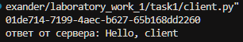
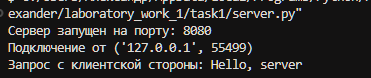
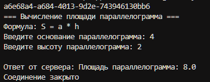
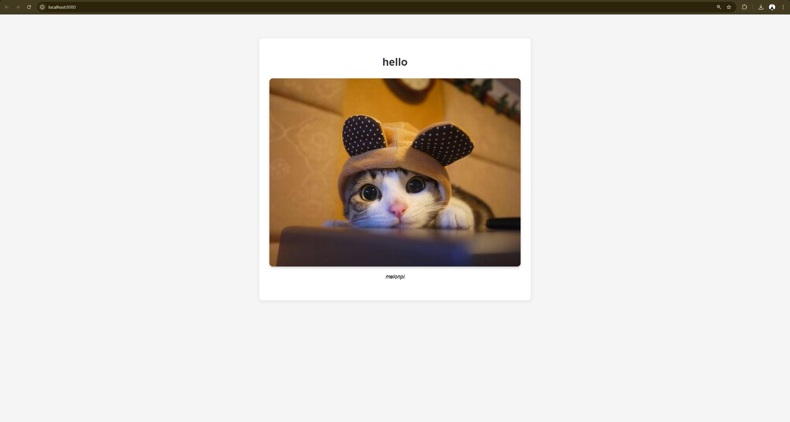
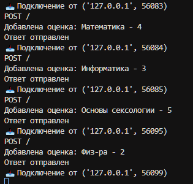

# Лабораторная работа №1: Работа с сокетами

## Цель работы
Освоить основы работы с сокетами в Python, изучить протоколы UDP и TCP, создать простые клиент-серверные приложения и веб-сервер.

## Задания

### Задание 1: UDP клиент-сервер
**Описание:** Реализовать клиент и сервер для обмена сообщениями по протоколу UDP.

**Функциональность:**
- Клиент отправляет сообщение "Hello, server" серверу
- Сервер отвечает "Hello, client"
- Использование протокола UDP (SOCK_DGRAM)

**Код клиента:**
```python
import socket

HOST = 'localhost'
PORT = 8080

def udp_client():
    conn = socket.socket(socket.AF_INET, socket.SOCK_DGRAM)
    conn.connect((HOST, PORT))
    conn.send(b"Hello, server \n")

    resp = conn.recv(1024)
    res = resp.decode("utf-8")
    print(f'\nответ от сервера: {res}')

    conn.close()

if __name__ == "__main__":
    udp_client()
```

**Код сервера:**
```python
import socket

HOST = 'localhost'
PORT = 8080

def udp_server():
    conn = socket.socket(socket.AF_INET, socket.SOCK_DGRAM)
    conn.bind((HOST, PORT))

    print(f"Сервер запущен на порту: {PORT}")

    while True:
        data, client_addr = conn.recvfrom(1024)
        print(f'Подключение от {client_addr}')

        request = data.decode("utf-8")
        print(f"Запрос с клиентской стороны: {request}")

        response = "Hello, client"
        conn.sendto(response.encode(), client_addr)

if __name__ == "__main__":
    udp_server()
```
**Пример работы:**

Работа клиента:


Работа сервера:

---

### Задание 2: TCP клиент-сервер для вычисления площади параллелограмма
**Описание:** Создать клиент-сервер приложение для вычисления площади параллелограмма по формуле S = a * h.

**Функциональность:**
- Клиент запрашивает у пользователя основание и высоту
- Сервер вычисляет площадь и возвращает результат
- Использование протокола TCP (SOCK_STREAM)

**Пример работы:**

Работа клиента:


Работа сервера:


---

### Задание 3: HTTP сервер
**Описание:** Реализовать простой HTTP сервер, который отдает HTML страницу с изображением и сообщением.

**Функциональность:**
- Сервер обрабатывает HTTP GET запросы
- Отдает HTML страницу с корректными заголовками
- Страница содержит изображение и текстовое сообщение

**Пример работы:**

HTML страница в браузере:


Логи сервера:


**Особенности:**
- Корректная обработка HTTP заголовков
- Поддержка UTF-8 кодировки
- Отображение изображений из внешних источников

---

### Задание 4: Многопользовательский чат
**Описание:** Создать многопользовательский чат с использованием TCP сокетов и потоков (threading).

**Функциональность:**
- Поддержка множественных подключений
- Broadcast сообщений всем клиентам
- История чата для новых пользователей
- Уведомления о подключении/отключении

**Скриншоты:**

Пример работы чата:


**Технические детали:**
- Использование `threading.Thread` для каждого клиента
- Thread-safe операции с `threading.Lock`
- Корректная обработка отключений клиентов
- Команда 'exit' для выхода из чата

---

### Задание 5: Веб-сервер с формами (GET/POST)
**Описание:** Реализовать веб-сервер для обработки GET и POST запросов с формой добавления оценок по дисциплинам.

**Пример работы:**

Веб-интерфейс:


Логи сервера:


**Особенности:**
- Полноценный HTTP сервер с парсингом запросов
- Обработка данных форм с `urllib.parse.parse_qs`
- Валидация и сохранение оценок
- Современный дизайн с градиентами и анимациями

## Выводы

В ходе выполнения лабораторной работы были изучены:

1. **Основы работы с сокетами** - создание клиент-серверных приложений
2. **Протоколы UDP и TCP** - их различия и области применения  
3. **HTTP протокол** - структура запросов и ответов
4. **Многопоточность** - обработка множественных соединений
5. **Веб** - создание интерактивных "веб-приложений/сервисов"
